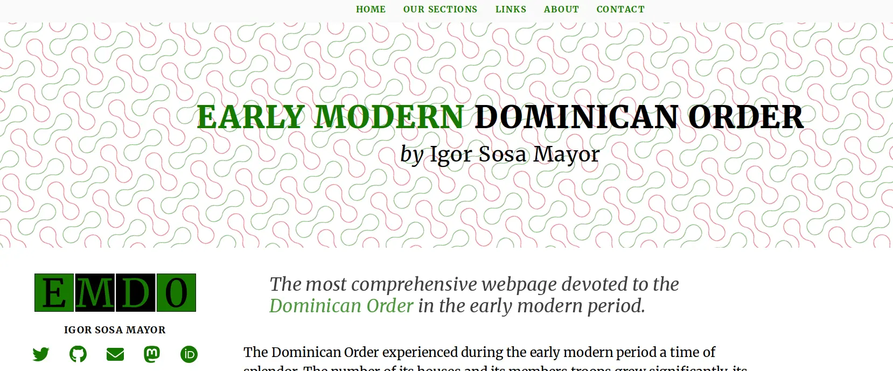

This code is the code for the webpage on [early modern
Dominicans](https://dominicans.georeligion.org). It is written with the
[Quasar framework](https://quasar.dev) (which uses the wonderful
framework [Vuejs](https://vuejs.org)).

It uses for the analysis of the data the Application Programming
Interface (API) developed by me and whose [code is accessible
here](https://github/rogorido/apidominicans).

This code has been written in the framework of the research project on
**Religious globalisation as challenge. Global governance, geopolitics
and costs in the Order of Preachers (1570-1700)**, led by me and funded
by the Spanish Ministry of Science and Innovation (Ref:
RTI2018-101224-B-I00).

The code is released under the [GNU General Public License version
3.0](https://www.gnu.org/licenses/gpl-3.0.html). 
